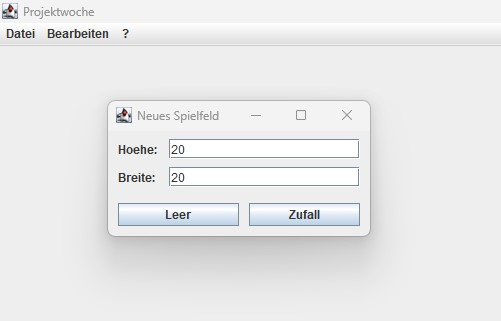
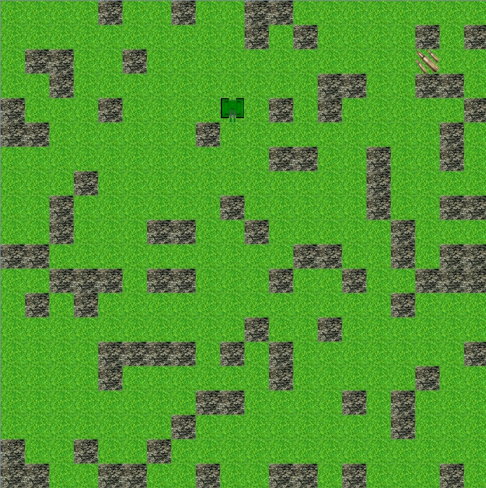
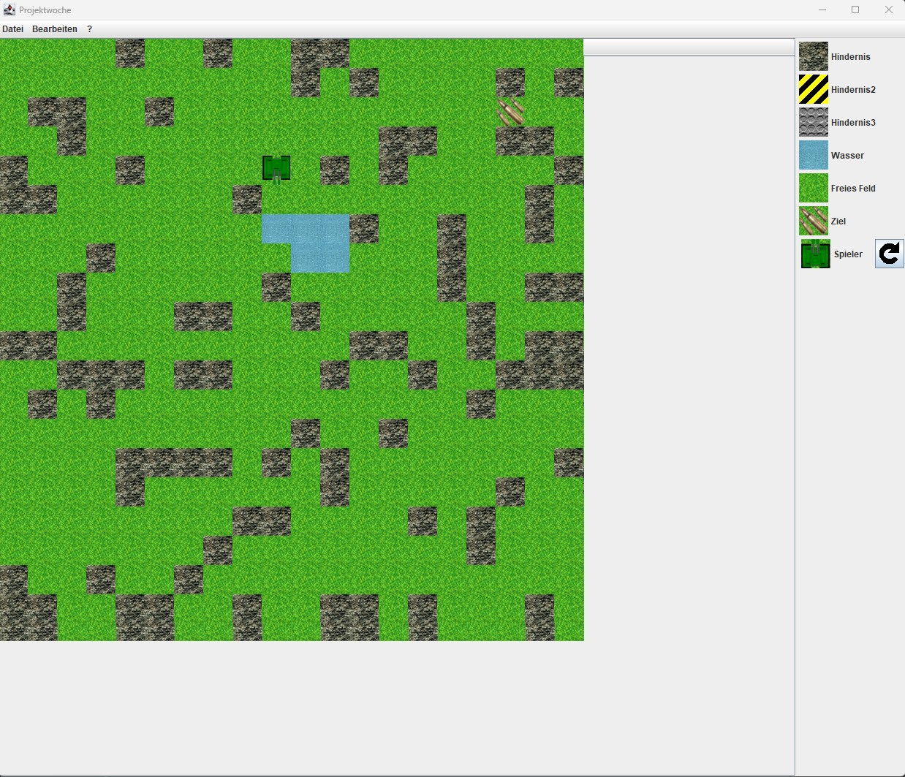
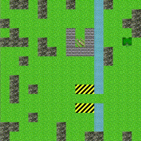

# path_finding_tank_game
This one is a bit older project I was working on with some colleagues to practice programming. It consists of GUI with a tank who automatically finds a shortest path in a random generated or self customized labyrinth.

# Initialize new field
In the menu we provide the option to create and save new game fields. The Field can be initialized empty or random. 
 
 
A random created field can look like below. There always need to be one "Tank" present, which try to find one "Ammo" in the field. 
 

# Editor
To customize the field yourself there is an editor available in the menu. It will look like the following
 
 
You can place new tiles with a right-click!

# Path finding
For the automatic path finding we implemented the A* algorithm https://en.wikipedia.org/wiki/A*_search_algorithm 
If there is no path between tank and ammo, simply nothing will happen. If it is the tank will start moving

# How it look like in action
